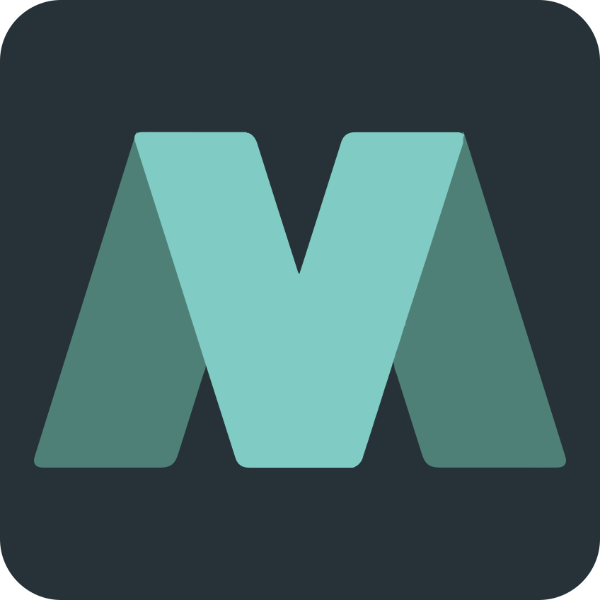
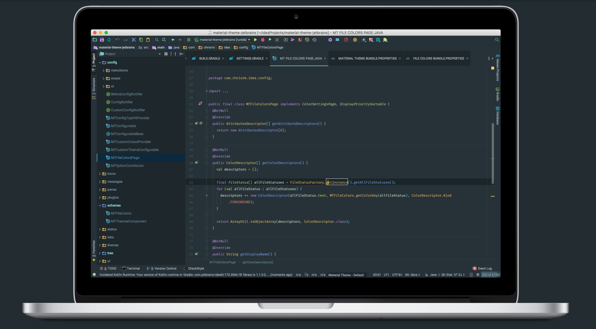

  <a href="https://www.material-theme.com">
    </img>
  </a>

# Material Theme UI for Jetbrains

This is a port of the famous [Material Theme](https://github.com/equinusocio/vsc-material-theme) for Jetbrains IDEs, allowing a total customization of the IDE including Themes, Color Schemes, Icons and many other features.

 

Plugin page: https://plugins.jetbrains.com/plugin/8006-material-theme-ui

## Documentation:

https://www.material-theme.com

#### Donate via Paypal:

_@ChrisRM_:

_@Mallowigi_:

#### OpenCollective Backers

<object type="image/svg+xml" data="https://opencollective.com/material-theme-jetbrains/tiers/backer.svg?avatarHeight=36&width=600"></object>

## Plugin

* [Support](#supported-ides)
* [Installation and Configuration](#installation)
  * [Switch Theme](#switching-the-ide-theme)
  * [Custom Themes](#custom-themes)
  * [Switch Color Scheme](#set-color-scheme-code)
  * [Custom Accents](#custom-accents)
* [Configuration](#configuration)
* [Development](#development)
* [Contribution](#contribution)
* [Known Issues](#known-issues)
* [Authors](#authors)
* [Contact](#contact)
* [Icon Reference](#icon-reference)
* [Color Palette](#color-palette)

## Supported IDEs

Thanks to the awesome guys at [JetBrains](https://www.jetbrains.com/) the plugin is now supported on pretty much all IDE, however there might be some issues on Rider since it's a different SDK. Android Studio is partly supported.

* IDEs versions 2016.X and lower > up until version 0.2.3
* IDEs versions 2017.1-2 > up until version 0.10.6
* IDEs versions 2017.3 > Up until version 1.6.0.4
* IDEs versions 2018.1 > Version 2.4.0-2018.1 and above
* IDEs versions 2018.2 > Version 2.4.0-2018.2 and above
* IDEs versions 2018.3+ > Version 2.10.0 and above

* Android Studio 2.2.3 > up until version 0.2.3
* Android Studio 3.0.0+ > All versions until 2.10

## Installation

1. [Open the Settings/Preferences dialog](https://www.jetbrains.com/idea/help/accessing-settings.html#openIdeSettings) (OSX/Unix: <kbd>⌘ + ,</kbd>, Windows: <kbd>Ctrl + Alt + S</kbd>)
2. In the left-hand pane, select **Plugins** (or in the new plugins page, select *Marketplace*)
3. Click **Browse repositories...** and search for `Material Theme UI` (or in the new plugins page, search for `Material Theme UI`)
4. Click **Install plugin** and confirm your intention to download and install the plugin.
5. Click **OK** in the **Settings** dialog and restart for the changes to take effect.

Note: This is not installing a new Look And Feel, instead, it is **overwriting** the Darcula theme.
Therefore, when you switch to another LAF and select back *Darcula*, you will revert to the original Darcula LAF. Just select a theme using the `Material Theme Switcher` to retrieve the theme back.

--------------------

### Switching the IDE theme

There are many ways to change the Material Theme Look and Feel of the IDE:
- From the IDE menu: `Tools -> Material Theme`
- From the main toolbar, there is an icon like a blue dot.
- From the `Search Everything`, look for `Material`
- From the `Quick Switch` panel <kbd>Ctrl + \`</kbd> (Windows: <kbd>Ctrl + ~</kbd>)
- From the Material Theme Settings directly

There are currently 4 bundled Material themes:
- **Oceanic Theme** - A nice Oceanic Blue like theme
- **Darker Theme** - A more classic Dark Theme
- **Lighter Theme** - A light variation of the theme
- **Palenight Theme** - A more purplish theme
- **Deep Ocean Theme** - A deep sea black theme

And 6 other bundled themes
- **Monokai Pro Theme**
- **Arc Dark Theme**
- **Atom One Dark Theme**
- **Atom One Light Theme**
- **Solarized Dark**
- **Solarized Light**

Besides, the plugin offers an endpoint allowing plugin developers to develop their own themes, just like color schemes. You can look for example for the [Dracula theme](https://plugins.jetbrains.com/plugin/10762-dracula-theme), a port of the Dracula color scheme.

You should also see the [Night Owl](https://github.com/xdrop/night-owl-jetbrains) porting using the Material Theme API while adding its own lot of options :)

And you can also disable the theming and revert to the original Darcula, while still keeping Material Theme additions such as the icons and UI components.

--------------------

### Custom Themes

With the ability to set up custom themes, we can even start to host a gallery of custom themes I will add some that are the most popular, or even give the ability to import them.

--------------------

### Set color scheme (code)

This plugin will not set the new color scheme for you, as that would cause a couple problems. You need to set the new color scheme manually:

1. Open the **Settings/Preferences** dialog again.
2. In the left-hand pane, select **Editor** -> **Colors & Fonts**.
3. In the **Scheme** dropdown, you'll find new schemes:
    1. `Material Oceanic`
    2. `Material Darker`
    3. `Material Palenight`
    4. `Material Lighter`
    5. `Material Deep Ocean`
    6. `Material Monokai Pro`
    7. `Atom One Dark`
    8. `Atom One Light`
    9. `Solarized Dark`
   10. `Solarized Light`
4. Choose the scheme you like and hit **Apply** and **OK**.

Shortcut: <kbd>Ctrl + \`</kbd> (Windows: <kbd>Ctrl + ~</kbd>) then hit `1. Color scheme` and select your desired color scheme. 

**Important!**

This plugin is coming with these bundled color schemes, the same way that IntelliJ comes with predefined color schemes such as Darcula, Solarized, Monokai and such. Therefore whenever you change one of their values to suit your needs the IDE will be creating a copy of the bundled scheme, and it will appear **blued** in the select box. 

That also means that subsequent updates of the plugin's color schemes will __not__ be reflected to your copies. In order to receive them, you will need to reset your changes:

1. Go to **Colors and Fonts**. At the right of your selected color scheme there is a gear icon.
2. Click on the gear and choose *Restore defaults*.

Of course you will lose all your changes, so if you need to reflect them back after resetting, create a copy first and go change by change.

**Note:** Sometimes resetting the defaults will not work... In this case you will have to manually delete your copy: https://intellij-support.jetbrains.com/hc/en-us/articles/206544519-Directories-used-by-the-IDE-to-store-settings-caches-plugins-and-logs

Then delete the *"@_user_Material Theme"* icls files.

--------------------

### Custom Themes

Since version 0.10.0 it is now possible to customize the Material Theme's theme colors to your own desires. You can find the options under **Appearance** -> **Material Custom Theme**. There you can find the different colors used and customize them to whatever suits your needs. Let your creative desires bloom!

In order to select your custom theme, you will need to select the theme inside the *Material Theme Chooser*, called *Custom Theme*.

A light variant is also available.

--------------------

### External Themes

Since version 2.0 an option for external plugins to import their own themes to the Material Theme plugin has been added but is still in beta-testing. An example of this is the [Dracula Theme](https://plugins.jetbrains.com/plugin/10762-dracula-theme) based on the popular [Dracula Color Scheme](https://draculatheme.com/).

You should also see the [Night Owl](https://github.com/xdrop/night-owl-jetbrains) porting using the Material Theme API while adding its own lot of options :)

Be creative and develop your own themes!

### Material Status File Colors

Since the latest releases Jetbrains removed the *File Status colors* from the Color Schemes and set it inside **Version Control** -> **File Status Colors**. However doing so removed the customability of the file status colors from the custom color schemes. This feature brings it back.

You can find the settings to set the file colors under **Colors and Fonts** -> **Material File Colors**. Of course, this is *per color scheme*, not *per theme*, so please take this into consideration.

**Note**: This feature conflicts with the **File Status Colors** IDE feature. Therefore it is highly preferrable to use the **Material File Colors** for all file colors based customizations. If you prefer to use IDE's settings instead, be aware that bugs could occur that I didn't take into consideration.

**Note 2**: This feature is modifying the IDE, meaning that removing/disabling the feature will keep these colors in place even after restarting the IDE. For a complete cleanup, you will need to delete the **@_user_Darcula.icls** file from inside the colors settings directory.

https://intellij-support.jetbrains.com/hc/en-us/articles/206544519-Directories-used-by-the-IDE-to-store-settings-caches-plugins-and-logs

Then delete the *"@_user_Darcula"* icls files.

--------------------

### Custom Accents

From version 0.7.0 the plugin can now have different accent colors! To change the Accent Color, just press on the *Accents* Action Button on the Toolbar/Quick Switch/Tools,
then select the desired accent color.

The Accent Color is changing:
- Active Tab Highlight Color (unless the custom tab highlight color is checked)
- Open folder icon
- Tool window icons hover color
- Modified file color
- Sliders
- Branches in VCS Log
- Progress Bar, Active Input, Selected checkbox, Selected Radio Button
- Edited and Pinned file indicators
- Fold/Unfold icons
- Documentation links and bold texts
- Pressed Action Button Toggle state
- Autocomplete
- Quick info
- Caret color
- Scrollbars (when the accent scrollbars is checked)
- Modified settings indicator
- Switches in Search Everything
- Navigation Bar selected items

--------------------

### Project View Decorators

Another feature taken from the Sublime Plugin is the ability to differentiate **opened directories** from closed ones.
*"Opened directories"* actually mean directories from the project view whose one of their children is opened in the Editor.

The plugin is decorating these directories by setting an "outlined" directory icon tinted with the selected *Accent color*.

You can disable this behavior through the Settings or the Action Buttons in the toolbar.

--------------------

### Decorated Folders

Another yet cool feature depending on the _Project View Decorators_ is the ability to set specific icons to commonly used directories such as `src`, `test`, `log`, `config` and so on. Just like the _File Icons_ feature, this allows to increase the visual grepping by quickly diffentiating between directories.

This is available from 2.1.5+

--------------------

## Configuration

You can customize some plugin features in a Settings Panel under **Settings** -> **Appearance** -> **Material Theme**:

More info at http://www.material-theme.com/docs/configuration/settings/

--------------------

## Development

### Requirements

* JDK 1.8
* IntelliJ IDEA with Gradle

### Developing using IntelliJ Gradle

You can simplify development process thanks to Intellij's **Gradle plugin**. Install the plugin, restart the IDE and you will be prompted with a window asking if you want to import the project as a Gradle project. After that IntelliJ will download the Gradle Wrapper and the tasks will appear in the Gradle Tool Panel on the right.

Import the project from the `build.gradle` file and develop as normal.  Make sure you select JDK 8 in the import wizard.  The other defaults are fine.  You can run the above mentioned CLI Gradle tasks directly in the "Gradle" Tool Window, which expands from the right side of the screen.  To debug, find "runIde" in the list, right-click it, and choose Run/Debug.

--------------------

## Contribution

Pull requests are appreciated! I can use some help on bugs and features listed in https://github.com/ChrisRM/material-theme-jetbrains/issues, or you can send me some new ideas!

--------------------

## Known Issues

### Scrambled fonts

Some users have been experiencing issues with the IDE after installing the plugin, specifically that their texts are scrambled. This is a known weird bug of which I have no idea of why it occurs or how to solve it. It could be because the JDK caches fonts or because there are conflicts between Roboto fonts, or that you have a bad version of Roboto.

Try to reinstall the Roboto font and restart the computer. If it still doesn’t work, just disable the option or select another font in the settings `(Appearance > Override Fonts)`

### Color Schemes copy

As stated in the Color Schemes section, whenever you change an attribute of the default color schemes a copy will be created, and from then on you won't be able to receive updates to the color schemes. However, in some occasions, especially when using third party plugins, the color schemes will be altered without your input, resulting in the aforementioned effect.

For instance, the _Markdown Navigator_ plugin creates a lot of properties when selecting a scheme, and even selecting `Restore Defaults` will still result to creating a copy.

### Dark Title Bar on Windows

The "Dark title bar" option is actually modifying the title bar color in the **whole operating system** in Windows. Since there is currently no way to do it per-application, this setting will modify the OS itself.

If you checked it and saved and want to change the color back, follow the instructions at https://www.howtogeek.com/225893/how-to-personalize-windows-10s-appearance/.

### File Colors stuck after uninstallation

The File Status Colors feature is also a feature that sticks outside of the realm of the plugin as it modifies the IDE itself. Therefore when uninstalling/disabling the plugin the colors will stuck.

If you want to reset to the default colors, open the Settings at `Version Control -> File Status Colors`  in 2017.3+. In previous versions, you will need to go to the config directory and delete the `_@user_Darcula.icls` color scheme manually.

--------------------

# Authors:
 
Twitter: [@crmag](https://twitter.com/crmag) [@mallowigi](https://twitter.com/mallowigi)

Official page: [@MJetbrains](https://twitter.com/MJetbrains)

Github: [@ChrisRM](https://github.com/chrisrm) [@Mallowigi](https://github.com/mallowigi)

Blog: http://www.material-theme.com/docs/blog/

**Thanks to [@equinusocio](https://github.com/equinusocio) and his original [Material Theme](https://github.com/equinusocio/vsc-material-theme) for the inspiration.**

# Contact

You can contact us or ask questions via [Gitter](https://gitter.im/Material-Theme-Jetbrains/Lobby#) or our brand new [Slack community!](https://join.slack.com/t/material-theme-ui/shared_invite/enQtMzgzNTUxMjQ2MTQ1LWU3Y2ZlYTBlNDEyZmU5YTMzNjAxZjc0NmVkMTk1NzdmNDI1NDAwMzI4NWYxZjVmYzUyYTgwZWEzNjE2YTg2NTA)

Come say hello!

## Other portings

The Material Theme has been ported to many other editors, applications, websites and other platforms:
- [Visual Studio Code](https://github.com/equinusocio/vsc-material-theme/) (by [@equinusocio](https://github.com/equinusocio)
- [Sublime Text](https://github.com/equinusocio/material-theme/) (also by [@equinusocio](https://github.com/equinusocio)
- [Hyper](https://github.com/equinusocio/hyper-material-theme) (also by [@equinusocio](https://github.com/equinusocio).
- [Atom](https://github.com/silvestreh/atom-material-ui) (by [@silvestreh](https://github.com/silvestreh))
- [Vim](https://github.com/kristijanhusak/vim-hybrid-material) (by [@kristijanhusak](https://github.com/kristijanhusak)).
- [Terminal OSX](https://gist.github.com/mvaneijgen/4c56701215847dd5ddcf) (by [@mvaneijgen](https://github.com/mvaneijgen)).
- [iTerm2](https://gist.github.com/Revod/3f3115f8d4b90fc986fd4b61441c2567) (by [@Revod](https://github.com/Revod)) and [iTerm2 Palenight](https://github.com/JonathanSpeek/palenight-iterm2) (by [@jonathanspeek](https://github.com/jonathanspeek)).
- [ConEmu](https://gist.github.com/rajadain/b306b2ba71bd58a1df41) (by [@rajadain](https://github.com/rajadain)).
- [Slack](https://slack.com/) (`#263238`, `#2E3A40`, `#80CBC4`, `#FFFFFF`, `#13191C`, `#FFFFFF`, `#50FA7B`, `#FF5555`)
- [Nylas N1](https://github.com/jackiehluo/n1-material) (thanks to [@jackiehluo](https://github.com/jackiehluo))
- [Base16](https://github.com/ntpeters/base16-materialtheme-scheme) (by [@ntpeters](https://github.com/ntpeters))
- [Notepad++](https://github.com/Codextor/npp-material-theme) (by [@Codextor](https://github.com/Codextor))

## Icon Reference

- All file icons have been built using the tools provided by [A File Icon](https://github.com/ihodev/a-file-icon). Great thanks to them!
- And of course many thanks to the SVG creators:
* [**File-Icons**](https://github.com/file-icons/source/blob/master/charmap.md) 
* [**FontAwesome 4.7.0**](http://fontawesome.io/cheatsheet/)
* [**Mfizz**](https://github.com/file-icons/MFixx/blob/master/charmap.md)
* [**Devicons**](https://github.com/file-icons/DevOpicons/blob/master/charmap.md)
* [**Octicons**](https://octicons.github.com)
* [**Material Design Icons**](https://materialdesignicons.com/)
* [**Many FlatIcons authors**](https://www.flaticon.com/)
* [**Philipp Kief**](https://github.com/PKief/vscode-material-icon-theme)

Thanks also for [@yonnyz](https://twitter.com/yonnyz) for the theme icons!

Also many thanks to other plugin developers for helping me solving A LOT of issues:
* [Nyan Progress Bar](https://plugins.jetbrains.com/plugin/8575-nyan-progress-bar)
* [Afterglow Theme](https://plugins.jetbrains.com/plugin/8066-afterglow-theme)
* [Git Toolbox](https://plugins.jetbrains.com/plugin/7499-gittoolbox)
* [Browse Word At Caret](https://plugins.jetbrains.com/plugin/201-browsewordatcaret)
* [GitIgnore](https://github.com/hsz/idea-gitignore)
* [Project Label](https://github.com/drinchev/project-label)

Thanks to all [original plugin contributors](https://github.com/ChrisRM/material-theme-jetbrains/graphs/contributors), [EAP contributors](https://github.com/mallowigi/material-theme-jetbrains-eap/graphs/contributors) and a special thanks to the guys at [JetBrains](https://www.jetbrains.com/) for contributing and showing interest in the project!

## Color Palette

| Color     | Default / Darker | Lighter   |
|:----------|:-----------------|:----------|
| Red       | `#FF5370`        | `#E53935` |
| Pink      | `#F07178`        | `#FF5370` |
| Orange    | `#F78C6C`        | `#F76D47` |
| Yellow    | `#FFCB6B`        | `#FFB62C` |
| Green     | `#C3E88D`        | `#91B859` |
| Pale Blue | `#B2CCD6`        | `#8796B0` |
| Cyan      | `#89DDFF`        | `#39ADB5` |
| Blue      | `#82AAFF`        | `#6182B8` |
| Purple    | `#C792EA`        | `#7C4DFF` |
| Violet    | `#BB80B3`        | `#945EB8` |
| Brown     | `#AB7967`        | `#AB7967` |

**Color Theme Reference**

| Color                | Default   | Darker    | Lighter   | Palenight |
| -------------------- | --------- | --------- | --------- | --------- |
| Background           | `#263238` | `#212121` | `#FAFAFA` | `#292D3E` |
| Foreground           | `#B0BEC5` | `#B0BEC5` | `#A7ADB0` | `#B0BEC5` |
| Selection            | `#546E7A` | `#424242` | `#546E7A` | `#676E95` |
| Primary Color        | `#607D8B` | `#616161` | `#A7ADB0` | `#A6ACCD` |
| Alternative Color    | `#546E7A` | `#616161` | `#B0BEC5` | `#676E95` |
| Inactive             | `#415967` | `#474747` | `#D2D4D5` | `#4E5579` |

**Accent Colors**

| Accent       | Color     |
|:-------------|:----------|
| Turquoise    | `#80CBC4` |
| Acid Lime    | `#C6FF00` |
| Amethyst     | `#AB47BC` |
| Aquamarine   | `#64FFDA` |
| Breaking Bad | `#388E3C` |
| Brick        | `#E57373` |
| Coffee       | `#795548` |
| Cyan         | `#00BCD4` |
| Daisy        | `#FFEB3B` |
| Dodger Blue  | `#2979FF` |
| Fuschia      | `#E91E63` |
| Gold         | `#FFD700` |
| Graphite     | `#616161` |
| Indigo       | `#3F51B5` |
| Lime         | `#7CB342` |
| Orange       | `#FF7042` |
| Pomegrenate  | `#F44336` |
| Sky          | `#84FFFF` |
| Slate        | `#607D8B` |
| Strawberry   | `#FF4081` |
| Teal         | `#009688` |
| Tomato       | `#F44336` |

## Contributors

This project exists thanks to all the people who contribute.

## Backers

Thank you to all our backers! 🙏 [[Become a backer](https://opencollective.com/material-theme-jetbrains#backer)]

Check also : http://www.material-theme.com/docs/support-us/

## Sponsors

Support this project by becoming a sponsor. Your logo will show up here with a link to your website. [[Become a sponsor](https://opencollective.com/material-theme-jetbrains#sponsor)]

